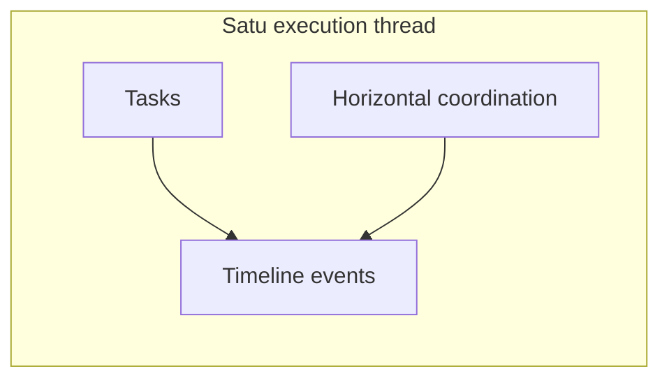

# GovTech Hardening — Matriks Role, Thread, Demo Mode & UAT

Dokumen ini menyatukan baseline pasca-audit: **role ↔ jabatan**, **RBAC**, **dashboard**, **thread compliance**, dan **kebijakan data demo**.

## 1. Role mapping resmi (`role.code`)

| Jabatan / peran organisasi | `role.code` | Dashboard default | Sumber permission |
|----------------------------|-------------|---------------------|-------------------|
| Bendahara Pengeluaran | `bendahara_pengeluaran` | `/dashboard/bendahara` | `backend/config/roleModuleMapping.json` |
| Bendahara Gaji | `bendahara_gaji` | `/dashboard/bendahara` | idem |
| Bendahara Barang | `bendahara_barang` | `/dashboard/bendahara` | idem |
| Bendahara (legacy) | `bendahara` | idem | idem — tetap didukung |
| Kepala Bidang Ketersediaan | `kepala_bidang_ketersediaan` | `/dashboard/ketersediaan` | idem |
| Kepala Bidang Konsumsi | `kepala_bidang_konsumsi` | `/dashboard/konsumsi` | idem |
| Fungsional Ketersediaan / Distribusi / Konsumsi | `fungsional_*` | `/dashboard/fungsional` | idem |
| Fungsional Perencanaan | `fungsional_perencanaan` | idem | idem |
| Fungsional Keuangan | `fungsional_keuangan` | idem | idem |
| Pelaksana per bidang | `pelaksana_ketersediaan`, … | `/dashboard/pelaksana` | idem |
| Pelaksana Sekretariat | `pelaksana_sekretariat` | `/dashboard/kasubag` | `getDashboardPath.js` |
| Kasubag TU UPTD | `kasubag_tu_uptd` | `/dashboard/kasubag-uptd` | idem |
| Kasi Mutu / Teknis | `kasi_mutu`, `kasi_teknis` | `/dashboard/kasi-uptd` | idem |
| Fungsional UPTD | `fungsional_uptd_mutu`, `fungsional_uptd_teknis` | `/dashboard/fungsional` | idem |

**Catatan:** Role generik (`fungsional`, `pelaksana`, `kepala_bidang`) **tetap ada** agar user lama tidak putus; user baru disarankan memakai kode spesifik.

## 2. Pemisahan wewenang bendahara (RBAC)

| Role | Inti kewenangan modul |
|------|------------------------|
| `bendahara_pengeluaran` | `sek-keu` + `upt-keu` (create/update), **tanpa** `delete` pada skema ini; `approval` create |
| `bendahara_gaji` | `kgb` + `sek-kep` read + `sek-keu` read — fokus gaji/kepegawaian |
| `bendahara_barang` | `upt-adm` + `upt-keu` (read/update), pengelolaan aset/barang |
| `bendahara` (legacy) | Gabungan luas (kompatibilitas) |

**Field mask KGB:** Hanya `bendahara`, `bendahara_gaji` (+ peran kepegawaian) — bukan `bendahara_pengeluaran` / `bendahara_barang` (separation of duties).

## 3. Mode data demo (frontend)

- **`frontend/src/config/appMode.js`**: `isDemoDataAllowed()` — default **mati** di produksi (`import.meta.env.PROD` + tanpa `VITE_DEMO_DATA=1`).
- **Development:** fallback boleh aktif kecuali `VITE_DEMO_DATA=0`.
- **Dashboard Sekretariat:** KPI/alert statis dan tabel lintas bidang contoh **hanya** jika demo aktif; produksi menampilkan pesan netral jika API kosong.

Set build produksi:

```bash
# .env.production
VITE_DEMO_DATA=0
```

## 4. Thread compliance audit

```bash
cd backend
npm run thread:audit
```

Keluaran JSON: jumlah baris tanpa `execution_thread_id` per tabel (`Tasks`, `SuratMasuk`, `SuratKeluar`, `Spj`, `PengajuanKeGubernur`).  
`THREAD_AUDIT_STRICT=1` → exit code 1 jika ada orphan.

**Catatan:** Banyak entitas modul BDS/BKS mengizinkan `execution_thread_id` null untuk transisi; perketat per endpoint/write path secara bertahap — tidak mengubah constraint DB global di hardening ini.

## 5. Matriks modul — status (ringkas)

| Kelompok | Siap UAT | Parsial / perlu bukti |
|----------|----------|-------------------------|
| Thread + horizontal coordination | Ya (API + model) | UAT skenario naskah dinas |
| Task / approval | Ya | Integrasi surat penuh |
| Dashboard Sekretaris | Ya | Panel e-Pelara / agregasi |
| Modul BDS/BKS/BKT | Per modul | Lihat catatan temuan BPK / form depth |
| Gubernur | Read-heavy | Instruksi digital penuh |

## 6. CTA utama per role (arah UX)

| Role | Aksi utama yang diharapkan |
|------|----------------------------|
| Sekretaris | Tindak lanjut approval, koordinasi horizontal, pantau thread |
| Kabid | Setujui / delegasi bidang, respons koordinasi |
| UPTD | Verifikasi lapangan, update task |
| Bendahara (per jenis) | Verifikasi jalur keuangan sesuai split role |
| Pelaksana | Selesaikan task, unggah bukti |
| Gubernur | Review indikator agregat (bukan entri data) |

## 7. Skenario UAT minimal (thread)

1. Buat / pilih `execution_thread_id` (UUID).  
2. Buat task pada thread yang sama.  
3. Ajukan horizontal coordination dengan `execution_thread_id` identik.  
4. Respons + ubah status hingga terminal.  
5. Verifikasi timeline thread berisi event konsisten.

## 8. Migrasi role DB

Jalankan migrasi CLI (PostgreSQL):

`backend/migrations/20260410-insert-govtech-expansion-roles.cjs`

## 9. File yang diubah / ditambah (rujukan)

- `backend/config/roleModuleMapping.json` — role & fieldMask KGB  
- `backend/migrations/20260410-insert-govtech-expansion-roles.cjs`  
- `backend/scripts/threadComplianceAudit.mjs` — audit orphan thread  
- `backend/package.json` — skrip `thread:audit`  
- `frontend/src/config/appMode.js`  
- `frontend/src/utils/getDashboardPath.js`  
- `frontend/src/ui/dashboards/DashboardSekretariat.jsx`  

## 10. Verifikasi akhir

1. `npm run db:migrate:cli` (backend)  
2. Agregat: `npm run verify:govtech-final`  
3. `npm run verify:bendahara-roles`  
4. `npm run thread:audit` (atau sudah tercakup no. 2)  
5. Build: `VERIFY_FRONTEND_BUILD=1 npm run verify:govtech-final` atau `cd frontend` + `VITE_DEMO_DATA=0 npm run build`  
6. Dashboard Sekretaris / Komoditas / Keuangan / Inflasi / Kepegawaian — tanpa dummy default di produksi (`appMode`).  
7. Uji login `bendahara_gaji` vs `bendahara_pengeluaran` pada endpoint terproteksi.

**Lihat juga:** `41-matriks-uat-jalur-kerja.md`, `42-terminology-canonical.md`, `frontend/src/components/dashboard/NextActionStrip.jsx`.

---

## Diagram alur thread (ringkas)


